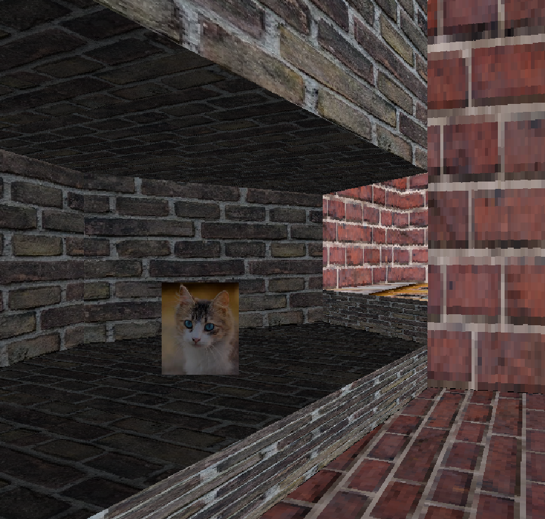

# Petra
A sector-based 3D engine written in Javascript.




## Controls
Use WASD to move, and the Mouse or Arrow Keys to look around. Press Space to go up, and Left Shift to go down.

Collision doesn't exist currently, so make sure not to go out of bounds.
## Use
You can view the project by going to https://lurnie.github.io/petra/.

If you want to host it yourself, download the files and run them with some kind of server.

For this, you can use [http-server](https://github.com/http-party/http-server) with ```npx``` by navigating to the file directory and putting ```npx http-server``` into the console. Then, go to http://192.168.12.205:8080.

## How It Works
This engine is sector-based, similar to the Build Engine. Basically, the level is split up into a bunch of convex (wall angles < 180) sectors. These sectors are all made up of walls. Sectors are connected by setting walls as "adjoins" (in other engines, these connections are often called portals).

The level is rendered by first drawing all the walls in the player's current sector.
Then, if any walls have adjoins, it will go to the adjoining sector and draw that one within a smaller window.
## Todo
-  [x] Load levels from files
- [x] Sky
- [ ] Collision
- [ ] More texture options
- [ ] Concave sectors
- [ ] Decals
- [ ] Slopes
-  [ ] Level editor

## Bugs
- Changing the zoom causes the floor to behave incorrectly
- If you get too close to an adjoin, part of it will get cut off

Please report any bugs you find.